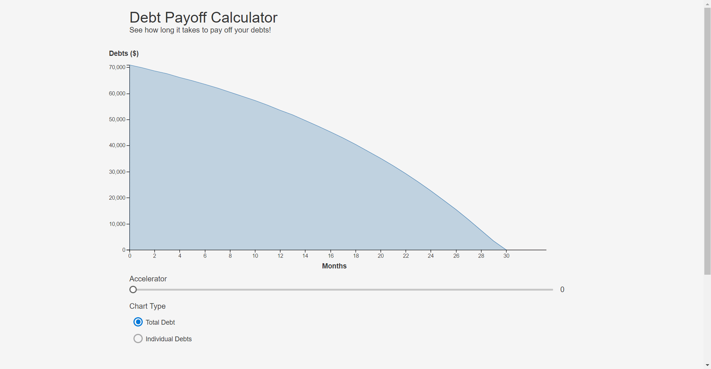

## Debt Payment Calculator

VIEW LIVE: https://geoffreyyip.github.io/dancing-cactus/

Enter your debt information to visualize how long it will take to pay them off. You can see how long it will take to pay off your individual debts, or how long it will take to pay off your debts in total.

If you're willing and able to pay a little bit extra each month, you can also specify an accelerator amount. An accelerator amount is the money you pay on top of your minimum payments. This calculator will automatically allocate that amount towards your highest-interest debts.

## Backlog

- Option to prioritize debts by lowest balance first. This payoff method allows users to get rid of their smaller debts as quickly as possible, and is popularly known as the Snowball method. While it is not as financially efficient as paying down the highest-interest debts first, it can have a powerful psychological effect and gives users one less thing to worry about with each debt paid.

- Option to show individual payment schedules per debt.

- Option for users to download data in an Excel spreadsheet.
